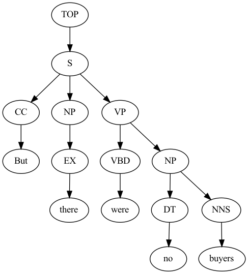
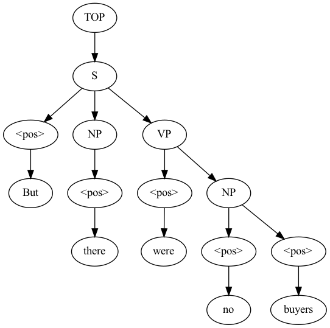

## LSTM-CRF implementation for Constituency Parsing

### Problem
Constituency Parsing is a type of syntactic parsing, which is the task of 
assigning a syntactic structure to a sentence. We will be using data from the 
English WSJ Penn TreeBank (PTB) to learn a constituency parser. In the dataset
itself, trees are represented as flattened strings with brackets and labels. For 
example,

`(TOP (S (NP (NNP Ms.) (NNP Haag)) (VP (VBZ plays) (NP (NNP Elianti))) (. .)))
`

### Assumptions
We’ll be assuming only binary tree and disregard unary and POS tag predictions for the current
project. Hence, in this project, the CRF structure is just for enforcing tree-shape, while the BiLSTM
will predict labels for spans independently. All labels are independent of one-another given the
sentence, making the parent label and child label independent. This is not true in PCFGs or original
CYK decoding. Since we skip the grammar rules, the runtime complexity of this version of decoding
is O(n<sup>3</sup>), `n` being the length of an input sentence.

### Metrics
For the constituency parsing, we will be mainly using labeled and unlabeled F1 scores on the
validation data set as metrics to measure and compare the performance of our models. Labeled F1 is
the harmonic mean of per-node labeled precision and recall. The exact accuracy can be computed as
well for the whole tree, but it’s going to be much lower since our model is pretty weak at the current
stage.

### Model
We try to model a tree dependency between parent and child labels using a simple CRF model in
an attempt to capture a local tree context while predicting a label. Unlike, independent model, CRF
uses a global normalization to compute a score for how likely a given label tree is. The normalization
term `Z` of this score involves computing the sum of scores of all possible tree labels for a given input
sentence. We employ a dynamic programming-based approach, `Inside` algorithm, to compute `Z` in an
efficient manner.

### Decoding
At decoding time, we use another similar dynamic programming approach, equivalent to Viterbi
algorithm used to compute the maximum likely tag sequence in a linear chain CRF model for an
input sentence, in an exact manner. We keep a matrix of probability scores in log space and also keep
a track of the best label for each span and use it to compute the best label for the parent spans that
maximizes this effective probability score.


### Getting Started

#### Installation
First, pull the repo, and under the `ConstituencyParsing` folder, run:

```sh
pip install opt_einsum graphviz stanza
python main.py
```
* Python package `opt_einsum` is used to speed up the bi-affine function.

#### Drawing a Tree

```python
# Check play.py for example
from node import from_string, draw_tree
l = "(TOP (NP (NNP Federal) (NNP Home) (NNP Loan) (NNP Mortgage) (NNP Corp.)))"
t = from_string(l)
draw_tree(t)
```

### Example

|             Test | Predicted        |
|-----------------:|:-----------------|
|  |  |

**Fig.** Example given tree for the sentence "But there were no buyers" from 
test data on the left and predicted tree by the model on the right.

