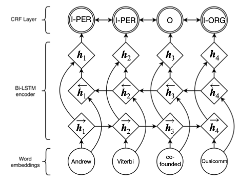

## BiLSTM-CRF implementation for NER

### Problem
Named Entity Recognition (NER) is a type of information extraction task with the
goal of identifying and classifying word spans (sequences of consecutive words
in a sentence) into categories such as person, organization, location, time, and
quantity.  
NER is an important processing step used to extract keywords for 
applications such as structured knowledge base creation. Example, given:

> _Andrew Viterbi co-founded Qualcomm, a company headquartered in San Diego._

After labeling each named entity span with its category:  

> _[Andrew Viterbi]person co-founded [Qualcomm]organization, a company headquartered in [San Diego]location._

**Data**: We will be using data from the CoNLL-2003 Shared Task [1], which only considers 4
classes of named entities: persons, locations, organizations and names of 
miscellaneous entities that do not belong to the previous three groups.

### Model
While a baseline model assumes independence between sequence tags, we try to model a linear
dependency between adjacent tags using a simple CRF model in an attempt to capture more context
while predicting a tag. Unlike, independent tagger model, CRF uses a global normalization to
compute a score for how likely a given sequence of tags is. The normalization term `Z` of this score
involves computing the sum of scores of all possible tag sequences for a given input sentence. We
employ a dynamic programming-based approach, `Forward` algorithm, to compute `Z` in an efficient
manner.

**Fig**. Bidirectional RNN-CRF to learn local sequential dependencies between neighboring output tags. Figure from [2].

### Assumptions
We’ll be assuming only binary tree and disregard unary and POS tag predictions for the current
project. Hence, in this project, the CRF structure is just for enforcing tree-shape, while the BiLSTM
will predict labels for spans independently. All labels are independent of one-another given the
sentence, making the parent label and child label independent. This is not true in PCFGs or original
CYK decoding. Since we skip the grammar rules, the runtime complexity of this version of decoding
is O(n3), `n` being the length of an input sentence.

### Decoding
At decoding time, we use another similar dynamic programming approach, `Viterbi` algorithm, to
compute the maximum likely tag sequence for an input sentence in an exact manner. 
We keep a matrix of probability scores in log space and also keep a track of the
best tag sequence until some position and use it to compute the best tag for the
next position that maximizes this probability score.

### Getting Started

#### Installation
First, pull the repo, and under the `NER` folder, two notebooks are provided: 
1. `baseline.ipynb` for independent tagger implementation
2. `colab_bilstmcrf.ipynb` for CRF implementation

TODO to convert these into python modules.

### Metrics
For the named entity recognition, we will be using accuracy of `non-O` tags, precision, recall and `F`β=1 
scores on the validation data set as metrics to measure and compare the performance of our models.

### Example

|            Sentence | June \<unk\> v British \<unk\> ( at Oxford , three days ) |
|--------------------:|:----------------------------------------------------------|
|          Actual Tag | O O O I-ORG I-ORG O O I-LOC O O O O                       |
| Baseline prediction | O I-ORG O I-MISC O O O I-ORG O O O O                      |
|      CRF prediction | O I-ORG O I-MISC I-ORG O O I-ORG O O O O                  |

Both the models confuse "Oxford" with an organization
while it is labeled a location in this particular sentence where both tags have similar meaning. 
It’s possible "Oxford" was present in another sentence as an `ORG` in the training data. 
Interestingly, CRF model, unlike baseline, is also able to predict `ORG` for an unknown after the
word "British" possibly highlighting the importance of introducing dependency between adjacent
tags. Meanwhile, the baseline model predicts `O` for all unknown <unk> tags.

#### References
1. https://www.clips.uantwerpen.be/conll2003/ner/
2. Guillaume Lample, Miguel Ballesteros, Sandeep Subramanian, Kazuya Kawakami, and Chris Dyer. Neural architectures for named entity recognition. arXiv preprint arXiv:1603.01360. 2016.
